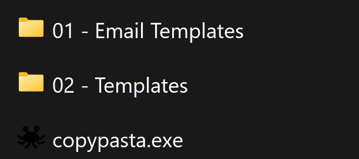
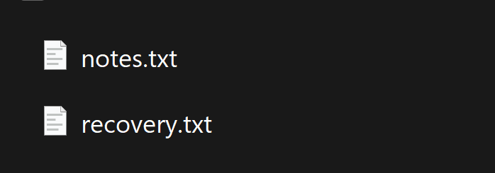
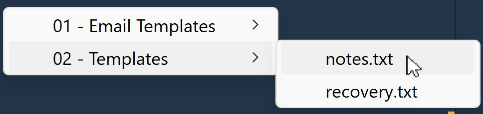

## CopyPasta

CopyPasta is a utility written with AHK script to streamline template management.

CopyPasta will copy and paste templates and bitmap images into emails, text boxes, word documents, or wherever ctrl + v works.

### Getting Started

Create a new folder on your PC and drop the .exe there.

- Don't run the .exe file from a large existing directory, or C:\

In the new folder, you can add subfolders and the files you wish to copy paste.

- It isn't recommended to utilize nested folders currently, as they aren't working as expected.

Example:

Example:

Double click copypasta.exe to run the program.

### Commands

#### Open Menu

    ctrl + shift + j

- This will show the menu which lists all the folders and files in the root of where you ran CopyPasta from.
- Use your arrow keys and the enter key or your mouse to select a file.

#### Rebuild Menu

    ctrl + win + r

- Use this when you update the name of a file or folder, or add a new file or folder.
- The menu is created the first time CopyPasta is run.  So to add new items to the menu while CopyPasta is running, you need to rebuild the menu.

### File Support

CopyPasta supports the following filetypes:

    .doc, .docx, .txt, .bmp
